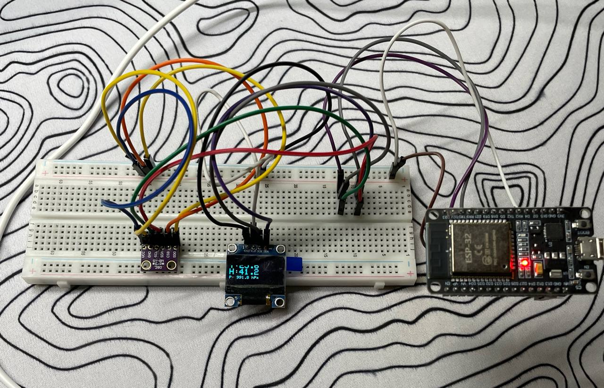
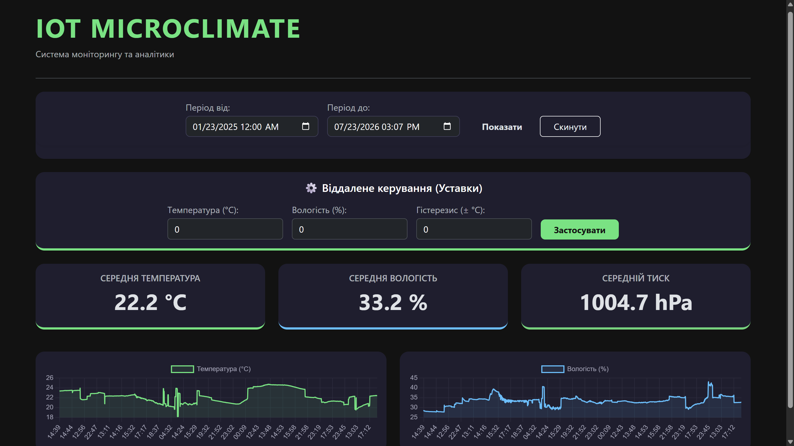

# Indoor Microclimate Control System (MVP)

A hardware and software complex designed to monitor and maintain the microclimate of a room with remote control via a web interface.

> **Note:** This project is currently in the **MVP (Minimum Viable Product)** stage. It is actively being developed to demonstrate the core functionality of sensor data aggregation and remote hardware control. Advanced features, such as user authentication and security roles, are planned for future releases.

## 📸 Project Showcase

### Hardware Prototype

*Prototype of the climate monitoring device based on ESP32.*

### Web Dashboard

*Real-time data visualization and control dashboard.*

## 📂 Project Structure

This repository is structured as a monorepo containing both the server backend and the microcontroller firmware.

* `/server` — Java Spring Boot backend application (handles REST API, business logic, and database interactions).
* `/firmware` — C++ code for the ESP32 microcontroller (reads sensor data and communicates with the server).
* `/docs` — Project documentation and media assets.

## 🛠 Tech Stack

**Hardware:**
* Microcontroller: ESP32
* Sensors: BME280 3.3V I2C (Temperature, Humidity, Pressure)
* Framework/Language: C++ / Arduino IDE

**Backend:**
* Language: Java 21
* Framework: Spring Boot
* Build Tool: Maven

**Frontend:**
* HTML/CSS/JS, Bootstrap

## 🚀 Getting Started

### 1. Server Setup

1. Navigate to the server directory:
```bash
   cd server
```

2. Build and run the application using Maven Wrapper:
```bash
   ./mvnw spring-boot:run
```

3. The server will start at `http://localhost:8080`.

### 2. Firmware Setup

1. Open the `/firmware` folder in your preferred IDE (e.g., Arduino IDE or VS Code with PlatformIO).
2. Configure your Server IP address in the file:
```cpp
   const char* serverName = "http://192.168.0.101:8080/api/sensor"; 
```
3. Flash the code to your ESP32 board.

## 🗺 Roadmap

- [x] Basic ESP32 sensor data reading.
- [x] Backend API for receiving and processing data.
- [x] Basic web interface for real-time monitoring.
- [ ] Add User Authentication and Authorization (JWT / Spring Security).
- [ ] Implement historical data charts and statistics.
- [ ] Add hardware control capabilities (e.g., turning on/off relays for fans or heaters).
